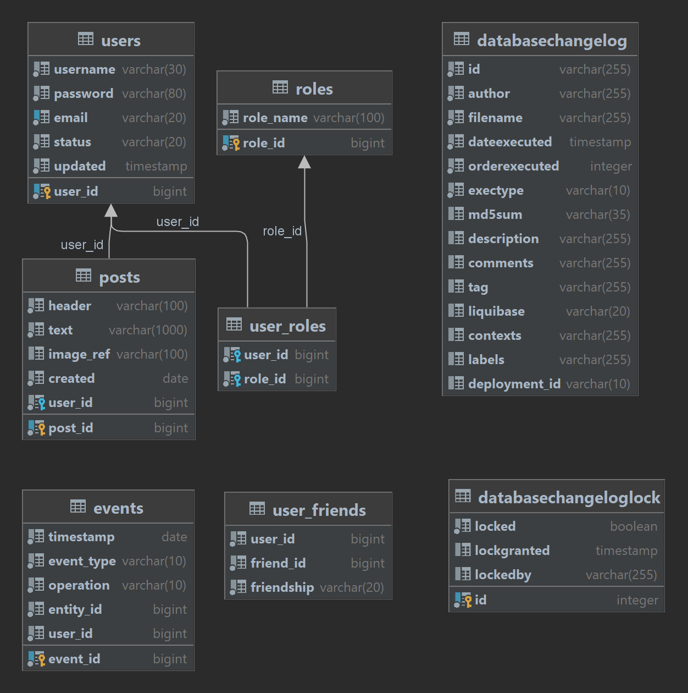

# socialMediaAPI
Test project for the Effective Mobile company

Реализованы API позволяющие пользователям:
- регистрироваться в системе при помощи имени пользователя и пароля
- выполнять вход в систему
- добавлять посты с текстом и ссылкой на изображение
- добавлять других пользователей в друзья и автоматически подписываться на ленту активности пользователя
- подтверждать или отклонять дружбу
- отменять заявку на добавление в друзья
- получать ленту активности друзей, на которых пользователь подписан
- администратор может просматривать информацию о пользователе
- фдминистратор может удалить пользователя из системы

Програмные модели, реализованные в данном приложении:

user - пользователь, содержит уникальный номер (ID), уникальное имя пользователя, уникальный адрес электронной почты, пароль и статус

post - пост, содержит уникальный номер (ID), заголовок, текст, дату создания, ссылку на изображение(опционально), данные пользователя создавшего данный пост

event - событие, содержит уникальный номер (ID), дату и время события, тип события, тип операции, идентификаторы пользователя и сущности к которой было применено данное событие

role - роль пользователя в системе, содержит уникальный номер (ID), имя и список пользователей

Для сохранения связи данных о пользователях и их роли в системе реализована дополнительная таблица user_roles.

Для сохранения дружбы пользователей реализована дополнительная таблица user_friends.

Аутентификация и авторизация пользователей в системе происходит с помощью SpringSecurity и использования JWT токенов 

Для тестирования в приложение есть Postman коллекция, содержащая базовые тесты на все реализованные эндпойнты. Тестирование пока возможно только в ручном режиме, в дальнейшем планируется автоматическое получение токенов. Файл data.sql для обнуления данных при тестировании (при раскоментировании строки spring.sql.init.mode=always в application.properties).

Для тестирования в приложение есть Postman коллекция, содержащая тесты на все реализованные эндпойнты и файл data.sql для обнуления данных при тестировании.

Спецификации API описаны в фйле api-docs.json

В дальнейшем планируется расширение функциональности и администрирования, добавление тестов и улучшение документации.

В приложении подключены зависимости: spring-boot-starter-web, spring-boot-starter-data-jpa, spring-boot-starter-validation, postgresql, lombok, spring-boot-starter-test, liquibase-core, springdoc-openapi-ui, jjwt, spring-boot-starter-security

Стек технологий: Java11, Spring Boot 2.7, Maven, PostgreSQL, Lombok, Spring JPA, REST, Docker, Hibernate

## Схема БД

